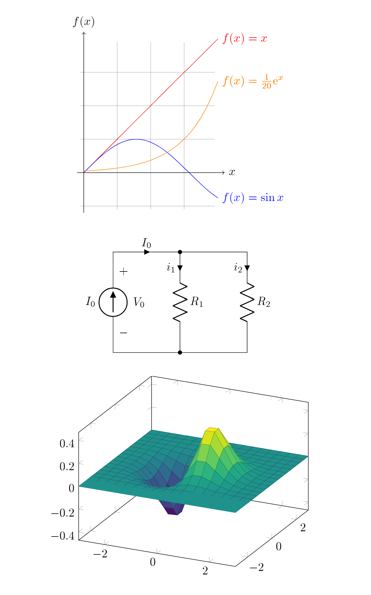

# Obsidian TikZJax
A plugin for Obsidian that lets you render LaTeX and TikZ diagrams in your notes. WIP!

Currently has these packages available in \usepackage{}:
- array
- pgfplots
- tikz-3dplot
- tikz-cd
- circuitikz


## Usage
````
```tikz
\begin{document}
  \begin{tikzpicture}[domain=0:4]
    \draw[very thin,color=gray] (-0.1,-1.1) grid (3.9,3.9);
    \draw[->] (-0.2,0) -- (4.2,0) node[right] {$x$};
    \draw[->] (0,-1.2) -- (0,4.2) node[above] {$f(x)$};
    \draw[color=red]    plot (\x,\x)             node[right] {$f(x) =x$};
    \draw[color=blue]   plot (\x,{sin(\x r)})    node[right] {$f(x) = \sin x$};
    \draw[color=orange] plot (\x,{0.05*exp(\x)}) node[right] {$f(x) = \frac{1}{20} \mathrm e^x$};
  \end{tikzpicture}
\end{document}
```
````


````
```tikz
\usepackage{circuitikz}
\begin{document}

\begin{circuitikz}[american, voltage shift=0.5]
\draw (0,0)
to[isource, l=$I_0$, v=$V_0$] (0,3)
to[short, -*, i=$I_0$] (2,3)
to[R=$R_1$, i>_=$i_1$] (2,0) -- (0,0);
\draw (2,3) -- (4,3)
to[R=$R_2$, i>_=$i_2$]
(4,0) to[short, -*] (2,0);
\end{circuitikz}

\end{document}
```
````


````
```tikz
\usepackage{pgfplots}
\pgfplotsset{compat=1.16}

\begin{document}

\begin{tikzpicture}
\begin{axis}[colormap/viridis]
\addplot3[
	surf,
	samples=18,
	domain=-3:3
]
{exp(-x^2-y^2)*x};
\end{axis}
\end{tikzpicture}

\end{document}
```
````

### Output:



## Known issues
- "\text" is an undefined control sequence. Fix: https://tex.stackexchange.com/questions/41035/what-is-causing-undefined-control-sequence
- tikz-cd -- in some diagrams, some nodes fail to render. Fix: remove svg tags inserted by html machine
- circuitikz -- some diagrams fail to render. Pgfkeys does not know the keys '/tikz/inline not', '/tikz/component text', etc. [Maybe we need to use a newer version of circuitikz?](https://tex.stackexchange.com/questions/510268/trouble-with-pfgkeys-and-circuitikz-with-dipchips) Check the current version with https://tex.stackexchange.com/questions/584600/latex-circuitikz-i-do-not-know-the-key-tikz-tr-circle
- pgfplots -- 3D surface plots don't fully render when there are too many points. For now, reduce the number of samples


## Notes
- The plugin requires an internet connection on first use in order to download the TikZJax files. After this, they should be cached and the plugin will work offline.
	- However, the cache is set to clear after 1 week. This means the plugin needs to redownload the TikZJax files, which requires an internet connection.
	- I'm working on bundling the files with the plugin to resolve these issues.


## Acknowledgements
This plugin would not be possible without [TikZJax](https://github.com/kisonecat/tikzjax) by [@kisonecat](https://github.com/kisonecat)! In particular, it uses
[@drgrice1's fork](https://github.com/drgrice1/tikzjax/tree/ww-modifications) that adds some additional features.