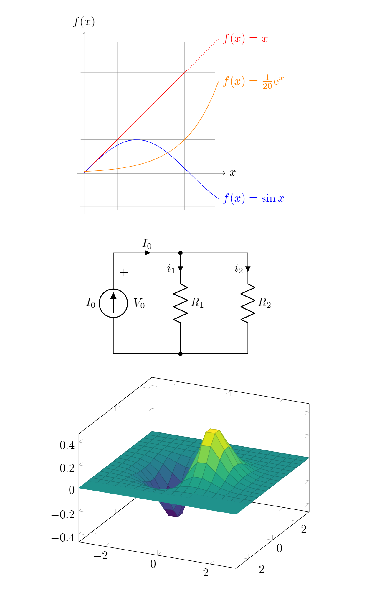
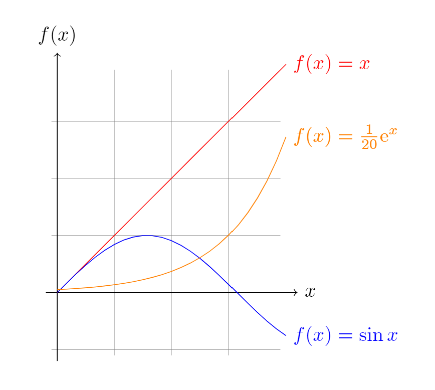
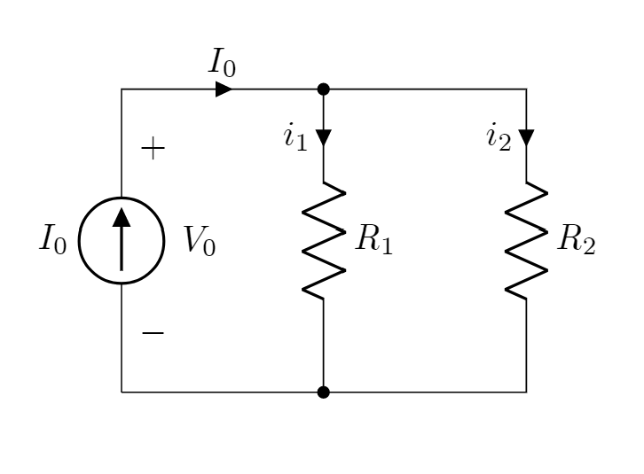
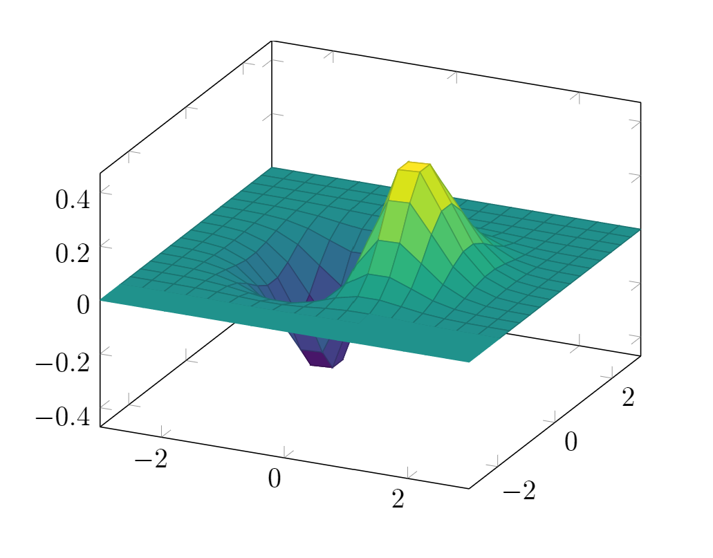
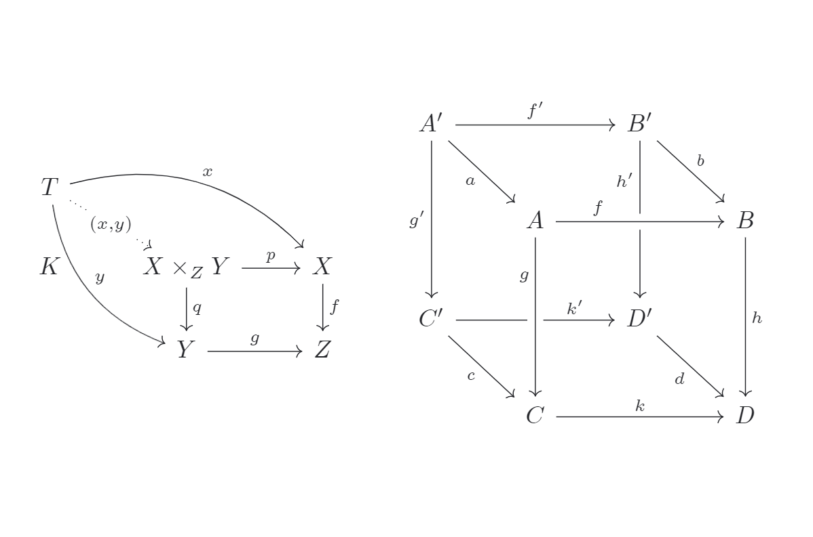
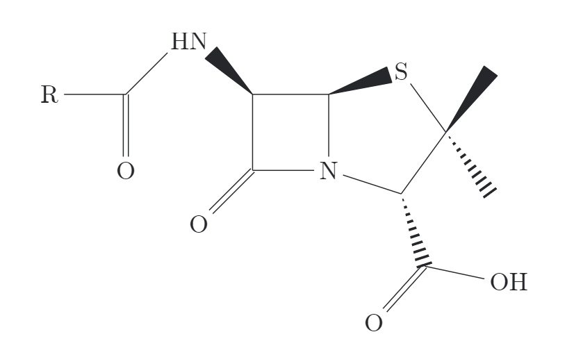
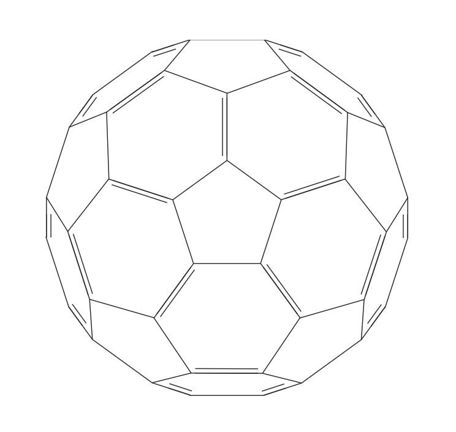
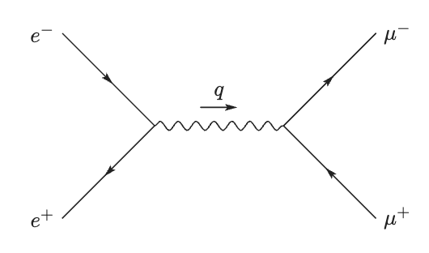

# Obsidian TikZJax

A plugin for Obsidian that lets you render LaTeX and TikZ diagrams in your notes.

You can render graphs, figures, circuits, chemical diagrams, commutative diagrams, and more.

The following packages are available in `\usepackage{}`:
- chemfig
- tikz-cd
- circuitikz
- pgfplots
- array
- amsmath
  - amstext
- amsfonts
- amssymb
- tikz-3dplot

## Usage
Content inside of `tikz` code blocks will be rendered by TikZJax.

- Remember to load any packages you need with `\usepackage{}`, and include `\begin{document}` and `\end{document}`.

- The standalone document class is used (`\documentclass{standalone}`).


### Examples


````latex
```tikz
\begin{document}
  \begin{tikzpicture}[domain=0:4]
    \draw[very thin,color=gray] (-0.1,-1.1) grid (3.9,3.9);
    \draw[->] (-0.2,0) -- (4.2,0) node[right] {$x$};
    \draw[->] (0,-1.2) -- (0,4.2) node[above] {$f(x)$};
    \draw[color=red]    plot (\x,\x)             node[right] {$f(x) =x$};
    \draw[color=blue]   plot (\x,{sin(\x r)})    node[right] {$f(x) = \sin x$};
    \draw[color=orange] plot (\x,{0.05*exp(\x)}) node[right] {$f(x) = \frac{1}{20} \mathrm e^x$};
  \end{tikzpicture}
\end{document}
```
````



````latex
```tikz
\usepackage{circuitikz}
\begin{document}

\begin{circuitikz}[american, voltage shift=0.5]
\draw (0,0)
to[isource, l=$I_0$, v=$V_0$] (0,3)
to[short, -*, i=$I_0$] (2,3)
to[R=$R_1$, i>_=$i_1$] (2,0) -- (0,0);
\draw (2,3) -- (4,3)
to[R=$R_2$, i>_=$i_2$]
(4,0) to[short, -*] (2,0);
\end{circuitikz}

\end{document}
```
````



````latex
```tikz
\usepackage{pgfplots}
\pgfplotsset{compat=1.16}

\begin{document}

\begin{tikzpicture}
\begin{axis}[colormap/viridis]
\addplot3[
	surf,
	samples=18,
	domain=-3:3
]
{exp(-x^2-y^2)*x};
\end{axis}
\end{tikzpicture}

\end{document}
```
````



````latex
```tikz
\usepackage{tikz-cd}

\begin{document}
\begin{tikzcd}

    T
    \arrow[drr, bend left, "x"]
    \arrow[ddr, bend right, "y"]
    \arrow[dr, dotted, "{(x,y)}" description] & & \\
    K & X \times_Z Y \arrow[r, "p"] \arrow[d, "q"]
    & X \arrow[d, "f"] \\
    & Y \arrow[r, "g"]
    & Z

\end{tikzcd}

\quad \quad

\begin{tikzcd}[row sep=2.5em]

A' \arrow[rr,"f'"] \arrow[dr,swap,"a"] \arrow[dd,swap,"g'"] &&
  B' \arrow[dd,swap,"h'" near start] \arrow[dr,"b"] \\
& A \arrow[rr,crossing over,"f" near start] &&
  B \arrow[dd,"h"] \\
C' \arrow[rr,"k'" near end] \arrow[dr,swap,"c"] && D' \arrow[dr,swap,"d"] \\
& C \arrow[rr,"k"] \arrow[uu,<-,crossing over,"g" near end]&& D

\end{tikzcd}

\end{document}
```
````



````latex
```tikz
\usepackage{chemfig}
\begin{document}

\chemfig{[:-90]HN(-[::-45](-[::-45]R)=[::+45]O)>[::+45]*4(-(=O)-N*5(-(<:(=[::-60]O)-[::+60]OH)-(<[::+0])(<:[::-108])-S>)--)}

\end{document}
```
````



````latex
```tikz
\usepackage{chemfig}
\begin{document}

\definesubmol\fragment1{

    (-[:#1,0.85,,,draw=none]
    -[::126]-[::-54](=_#(2pt,2pt)[::180])
    -[::-70](-[::-56.2,1.07]=^#(2pt,2pt)[::180,1.07])
    -[::110,0.6](-[::-148,0.60](=^[::180,0.35])-[::-18,1.1])
    -[::50,1.1](-[::18,0.60]=_[::180,0.35])
    -[::50,0.6]
    -[::110])
    }

\chemfig{
!\fragment{18}
!\fragment{90}
!\fragment{162}
!\fragment{234}
!\fragment{306}
}

\end{document}
```
````

Common settings for multiple figures and multiple notes can be written in a separate
file in some subfolder of your vault. For example,
````latex
%% config/tikzsettings.tex

\usepackage{amsmath}
\usetikzlibrary{arrows.meta}
\usetikzlibrary{calc}
\usetikzlibrary{decorations.pathmorphing}
\usetikzlibrary{decorations.markings}
\tikzset{
    every picture/.style={scale=1.5, semithick, line cap=round},
    fermion/.default=0.5,
    fermion/.style={postaction={decorate, decoration={
        markings,
        mark=at position #1 with {\arrow{Stealth[angle=30:6pt,inset=1pt]}},
        transform={xshift={3pt*cos(15)}}
    }}},
    photon/.default=6pt,
    photon/.style={
        decorate, decoration={
            snake,
            amplitude=0.25*#1,
            segment length=#1
        }
    },
    pics/momentum/.style n args={4}{
        code={
            \draw[solid, -{Stealth[angle=30:6pt,inset=1pt]}]
                ({-0.3*cos(#1)-#2*sin(#1)}, {-0.3*sin(#1)+#2*cos(#1)}) --
                ({0.3*cos(#1)-#2*sin(#1)}, {0.3*sin(#1)+#2*cos(#1)})
                node[pos=0.5, #3]{#4};
        }
    }
}
````
And then the settings can be imported using the macro `%:input path/to/settings`:

````latex
```tikz
%:input config/tikzsettings.tex
\begin{document}
\begin{tikzpicture}
  \draw[fermion] (-1.7, 1) node[left]{$e^-$} -- (-0.7, 0);
  \draw[fermion] (-0.7, 0) -- (-1.7, -1) node[left]{$e^+$};
  \draw[photon=8.3pt] (-0.7, 0) -- (0.7, 0)
    pic[pos=0.5]{momentum={0}{0.3}{above}{$q$}};
  \draw[fermion] (1.7, -1) node[right]{$\mu^+$} -- (0.7, 0);
  \draw[fermion] (0.7, 0) -- (1.7, 1) node[right]{$\mu^-$};
\end{tikzpicture}
\end{document}
```
````

## Contributing
Contributions are welcome! For information on building Tikzjax, have a look at the [contributing guide](https://github.com/artisticat1/obsidian-tikzjax/issues/68), courtesy of [@thecodechemist99](https://github.com/thecodechemist99).

## Acknowledgements
This plugin would not be possible without [TikZJax](https://github.com/kisonecat/tikzjax) by [@kisonecat](https://github.com/kisonecat)! In particular, it uses
[@drgrice1's fork](https://github.com/drgrice1/tikzjax/tree/ww-modifications) that adds some additional features.
